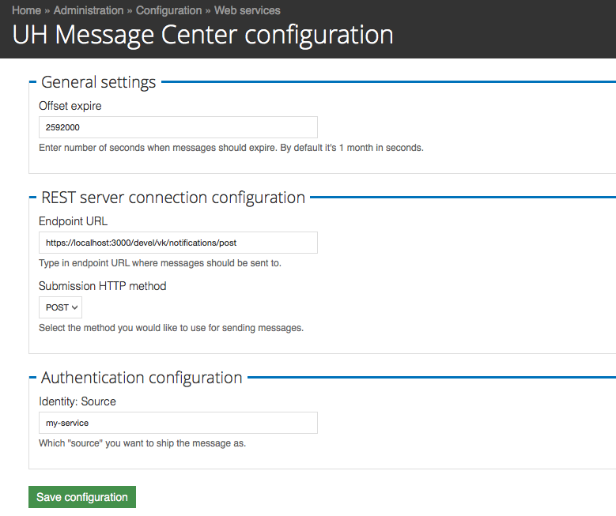

# University of Helsinki, MECE

This is a Drupal 7 module that provides ability to communicate with Message
Center (MECE) maintained by Center for Information Technology (University of
Helsinki).

## Requirements
* [Libraries module](https://www.drupal.org/project/libraries)
* [MECE PHP library](https://github.com/UniversityofHelsinki/mece-php)

# Branches
See branch [7.x-1.x](https://github.com/UH-StudentServices/uh-mece/tree/7.x-1.x), which is the currently development branch.

## Planned Milestones
* Implement submodule for rendering an JS widget (as block perhaps?)

## Screenshot

## Questions
Please post your question to doo-projekti@helsinki.fi

## License
This software is developed under [GPL v3](LICENSE.txt).
